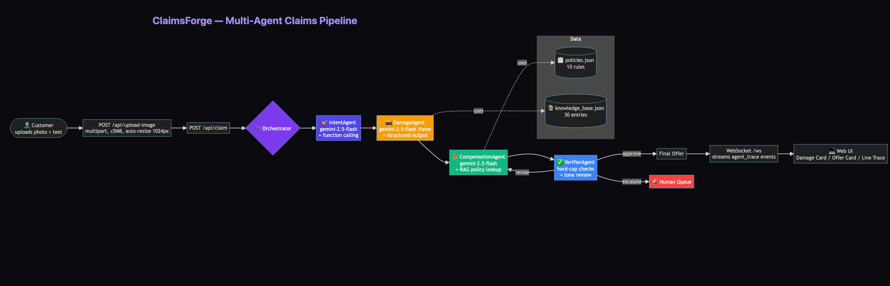

# ClaimsForge — Multi-Agent Claims Resolution

> **AI claims agent for e-commerce damage resolution.** Customer uploads a photo of a damaged product → 4 Gemini-powered agents negotiate a fair compensation in ~8 seconds → auto-resolve within policy thresholds, escalate edge cases to humans.

🏆 Built for **Milan AI Week 2026 — AI Agent Olympics Hackathon** (Google Gemini + Vultr tracks).

🔗 **Live demo:** _coming after Vultr deploy_
🎬 **Demo video:** _coming on May 19_
📦 **Tech:** FastAPI · Python 3.12 · Gemini 2.5 Flash + Vision · Vultr Cloud Compute

---

## 🎯 Problem

E-commerce returns cost retailers an estimated **$743B/year** globally. The bulk of low-value damage claims (broken mug, scratched screen, torn jacket) are handled by humans reading photos and arguing over $20–$50. Each claim drags 2–4 days of email back-and-forth and 15 minutes of agent time.

**ClaimsForge automates 90% of low-value claims** — multi-agent reasoning + Gemini Vision evidence assessment, with policy-grounded compensation offers and built-in safety rails.

---

## 🏗️ Architecture



Four specialist agents run in a sequential pipeline coordinated by a lightweight orchestrator (no LangChain — just one Python file, ~150 LOC):

| Agent | Model | Job |
|---|---|---|
| 🎯 **IntentAgent** | gemini-2.5-flash + function calling | Classify intent (`claim_with_image` / `claim_text_only` / `general_inquiry`), extract `order_id`. |
| 📸 **DamageAgent** | gemini-2.5-flash **Vision** + structured output | Assess damage from photo: `{damage_type, severity 0-10, affected_parts, confidence, reasoning}`. |
| 💰 **CompensationAgent** | gemini-2.5-flash + RAG policy lookup | Pick the matching policy from `data/policies.json` (10 rules) and propose an offer. Applies emotion-aware uplift (e.g. P-EMO-01 = +20% when customer emotion ≥ 8). |
| ✅ **VerifierAgent** | hard-cap checks + LLM tone review | Cap amount to policy max, escalate on low evidence, request tone revision if justification is too cold. Max 1 revision loop. |

The orchestrator streams each agent's progress as a WebSocket `agent_trace` event, so the UI shows the pipeline thinking live.

---

## ⚡ Quick start (local)

```bash
git clone https://github.com/zhenyueD/claimsforge.git
cd claimsforge
python3.12 -m venv .venv && source .venv/bin/activate
pip install -r requirements.txt

# Get a free Gemini API key at https://aistudio.google.com/apikey
cp .env.example .env
# edit .env, paste your GOOGLE_API_KEY

python run.py
open http://localhost:8000
```

Then click the **🔥 试 Claim Demo** button (top-right of the scenario bar) → pick a scenario → watch all 4 agents run end-to-end in ~8s.

---

## 🐳 Docker

```bash
docker build -t claimsforge:latest .
docker run -p 8000:8000 -e GOOGLE_API_KEY=$YOUR_KEY claimsforge:latest
```

Image is ~377MB (Python 3.12-slim base). Health check baked in.

---

## ☁️ Deploying on Vultr

This project is designed to run on a single **Vultr Cloud Compute Regular** instance ($6/month, 1 vCPU + 1GB RAM is enough for demo traffic). Vultr is the central system of record for this hackathon entry — deployment, logs, and demo URL all live there.

```bash
# On a fresh Ubuntu 24.04 Vultr instance:
curl -fsSL https://get.docker.com | sh
docker run -d --restart=always --name claimsforge \
  -p 80:8000 \
  -e GOOGLE_API_KEY=$YOUR_KEY \
  ghcr.io/zhenyued/claimsforge:latest      # or your own image

# Optional: nginx reverse proxy + Let's Encrypt SSL via certbot
```

Total setup time: ~10 minutes. See [`docs/deploy-vultr.md`](docs/deploy-vultr.md) for the full step-by-step.

---

## 🧪 Testing

```bash
# Smoke-test individual agents
source .venv/bin/activate
python -m agents.damage_agent     # vision assess sample images
python -m agents.intent_agent     # 5 canned intent classification cases
python -m agents.orchestrator     # end-to-end pipeline

# E2E HTTP test
curl -X POST http://localhost:8000/api/claim \
  -H "Content-Type: application/json" \
  -d '{"message":"我的杯子破了","session_id":"smoke","image_id":"demo:mug_crack.jpg","estimated_value_cents":2400}'
```

---

## 📁 Repository layout

```
agents/
├── schemas.py             # Pydantic models — ClaimContext + agent outputs
├── gemini_client.py       # google-genai SDK wrapper (chat / vision / structured)
├── intent_agent.py        # ⓵ classify + extract order_id
├── damage_agent.py        # ⓶ Gemini Vision damage assessment
├── compensation_agent.py  # ⓷ RAG policy lookup + offer
├── verifier_agent.py      # ⓸ hard-cap + tone review
├── orchestrator.py        # 🎼 the pipeline
└── ... (legacy easyclaw helpers — escalation, observer, knowledge_pipeline)

api/main.py                # FastAPI app + WebSocket + 6 ClaimsForge endpoints
data/
├── policies.json          # 10 compensation policies (damage / emotion / evidence)
├── demo_scenarios.json    # 3 judge-friendly canned cases
├── demo_images/           # placeholder images for demo scenarios
└── knowledge_base.json    # legacy KB (kept for hybrid RAG)
web/index.html             # SPA, single file — chat + agent trace + Damage/Offer cards
Dockerfile                 # production deploy
docs/
├── architecture.png       # the architecture diagram above
├── architecture.mmd       # mermaid source
└── LEGACY_README.md       # original easyclaw-demo README (preserved)
```

---

## 🎨 What makes it Gemini-native

- **`response_schema` + Pydantic** — every agent gets typed JSON back, zero parsing acrobatics.
- **Multimodal in one call** — DamageAgent passes image bytes + user text + JSON schema to Gemini in a single `generate_content` call.
- **`thinking_budget=0`** — explicit control over Gemini 2.5's built-in reasoning budget. We disable thinking for fast classifier/extractor agents, enable for nuanced verifier review.
- **Native function calling** — IntentAgent and CompensationAgent expose tools (`lookup_policy`, `extract_order_id`) via Gemini's `FunctionDeclaration`.

---

## 📊 Hackathon submission tracks

This submission hits **4 of 5** umbrella tracks for the Gemini main challenge:

- ✅ **Agentic Workflows** — Orchestrator + 4 agents with revision loops + escalation
- ✅ **Enterprise Utility** — Solves a $743B operational pain point for e-commerce
- ✅ **Multimodal Intelligence** — Gemini Vision evidence-based damage assessment
- ✅ **Collaborative Systems** — Specialist agents share state via typed `ClaimContext`

Plus eligible for **Vultr Award** (web-based enterprise agent deployed on Vultr).

---

## 🙏 Credits

- Built on top of [easyclaw-demo](https://github.com/zhenyueD/easyclaw-demo) (the customer service backbone — RAG, emotion analyzer, escalation engine).
- Powered by **Google Gemini 2.5 Flash + Vision** via the [google-genai](https://github.com/googleapis/python-genai) SDK.
- Deployed on **Vultr Cloud Compute**.
- Hosted by [lablab.ai](https://lablab.ai) and [Milan AI Week 2026](https://aiweek.it).

---

## License

MIT — see [`LICENSE`](LICENSE).
